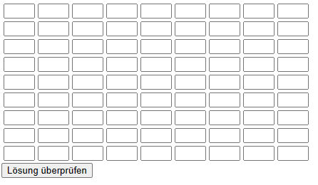

---
# Aufgabe
 

Eure Aufgabe ist es, eine HTML-Datei namens sudoku.html zu erstellen mit einer HTML Tabelle für das Spielfeld.
* 100 Punkte
* 45 Minuten (Viel Erfolg!)

---
<ol>
<li> Style das Sudoku mit CSS (15 Punkte)</li>
<ul><li> Füge ein Stylesheet mit dem Namen sudoku.css hinzu</li></ul>
<ul><li> Verlinke das Stylesheet in der sudoku.html-Datei</li></ul>
Hilfe: 
<ul><li><a href="https://www.w3schools.com/css/css_howto.asp">Spickzettel</a></li></ul> 

---
<li> Style den Body (15 Punkte)</li>
<ul><li> Setze die Schriftart für die gesamte Seite auf Arial oder eine andere sans-serif-Schriftart</li></ul>
<ul><li> Zentriere den Text</li></ul>
<ul><li> Lege die Hintergrundfarbe auf #f0f0f0 fest</li></ul>
Hilfe: 
<ul><li><a href="https://www.w3schools.com/cssref/pr_font_font-family.php">Spickzettel</a></li></ul> 
<ul><li><a href="https://www.w3schools.com/cssref/pr_text_text-align.php">Spickzettel</a></li></ul> 
<ul><li><a href="https://www.w3schools.com/cssref/pr_background-color.php">Spickzettel</a></li></ul> 

---
<li> Style das Sudoku-Grid (10 Punkte)</li>
<ul><li> Zentriere das Sudoku-Grid auf der Seite, indem du margin verwendest</li></ul>
<ul><li> Achte darauf, dass du in dem stylesheet mittels der id-Eigenschaft auf das sudoku-grid referenzierst!</li></ul>
Code-Beispiel: 
<ul><li><code>#firstname {background-color: #f0f0f0;}</code></li></ul>
Hilfe: 
<ul><li><a href="https://www.w3schools.com/cssref/sel_id.php">Spickzettel</a></li></ul> 
<ul><li><a href="https://www.w3schools.com/css/css_margin.asp">Spickzettel</a></li></ul> 

---
<li> Zellenränder für das Grid setzen (15 Punkte)</li>
<ul><li> Passe Breite (width) und Höhe (height) der Zellen an (30px und 30px)</li></ul>
<ul><li> Zentriere den Text (text-align) in allen Zellen</li></ul>
<ul><li> Lege die Zellenränder (border) auf 1px solid #000 fest</li></ul>
Hilfe: 
<ul><li><a href="https://www.w3schools.com/css/css_dimension.asp">Spickzettel</a></li></ul> 
<ul><li><a href="https://www.w3schools.com/cssref/pr_text_text-align.php">Spickzettel</a></li></ul> 
<ul><li><a href="https://www.w3schools.com/css/css_border_shorthand.asp">Spickzettel</a></li></ul> 

---
<li> Style die Zellen im Grid (15 Punkte)</li>
<ul><li> Setze die Breite und Höhe jeweils auf 30px</li></ul>
<ul><li> Zentriere den Text in den Zellen</li></ul>
<ul><li> Passe die Schriftgröße auf 16px an</li></ul>
<ul><li> Lege  den Zellenrand (border) auf 1px solid #000 fest</li></ul>
Hilfe: 
<ul><li><a href="https://www.w3schools.com/css/css_dimension.asp">Spickzettel</a></li></ul> 
<ul><li><a href="https://www.w3schools.com/cssref/pr_text_text-align.php">Spickzettel</a></li></ul> 
<ul><li><a href="https://www.w3schools.com/css/css_border_shorthand.asp">Spickzettel</a></li></ul> 
<ul><li><a href="https://www.w3schools.com/css/css_font_size.asp">Spickzettel</a></li></ul> 

---
<li> Styling des Buttons Lösung überprüfen (20 Punkte)</li>
<ul><li> Lege die Hintergrundfarbe (background-color) auf #008CBA fest</li></ul>
<ul><li> Die Schriftfarbe (color) soll #fff sein</li></ul>
<ul><li> Die Schriftgröße (font-size) soll 18px sein</li></ul>
<ul><li> Setze das Padding auf 10px 20px</li></ul>
<ul><li> Setze die border auf none</li></ul>
<ul><li> Erstelle einen Mauszeiger für den Button. Das heißt, dass du cursor auf pointer setzen sollst</li></ul>
Code-Beispiel: 
<ul><li><code>button { cursor: pointer; }</code></li></ul>
Hilfe: 
<ul><li><a href="https://www.w3schools.com/cssref/pr_background-color.php">Spickzettel</a></li></ul> 
<ul><li><a href="https://www.w3schools.com/css/css3_buttons.asp">Spickzettel</a></li></ul> 
<ul><li><a href="https://www.w3schools.com/cssref/pr_class_cursor.php#gsc.tab=0">Spickzettel</a></li></ul> 

---
<li> Ändere die Hintergrundfarbe beim Hovern über die Schaltfläche des Buttons auf die Farbe #005f7f (10 Punkte)</li>
Hilfe: 
<ul><li><a href="https://www.w3schools.com/cssref/sel_hover.php">Spickzettel</a></li></ul> 

---
</ol>
